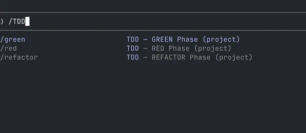
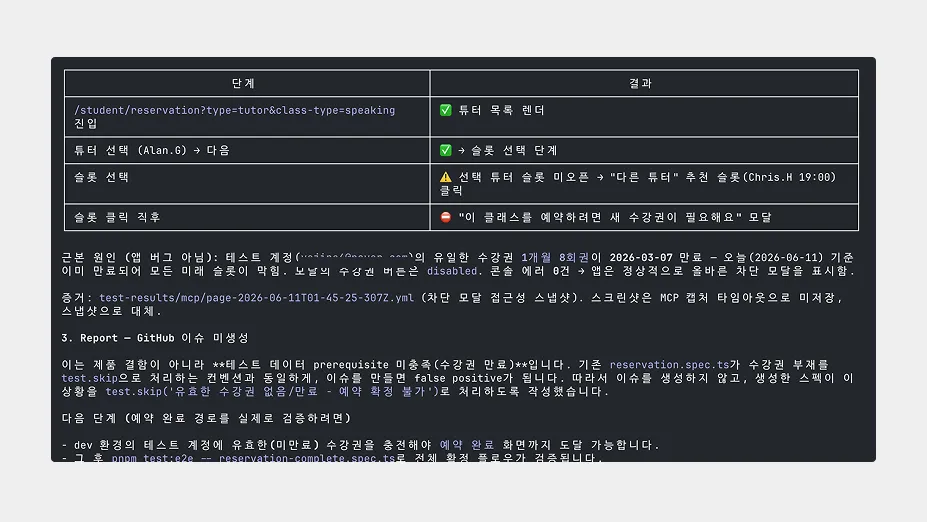
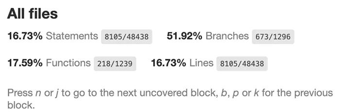

테스트 코드가 거의 없는 상태에서 프론트엔드 프로젝트를 혼자 운영하면서, 기능 변경 이후 영향을 확인하는 비용이 생각보다 크다는 점을 자주 느꼈습니다.

기능을 추가하거나 레거시 코드를 정리할 때마다 예상하지 못한 영향 범위를 직접 확인해야 했고, 시간이 지날수록 검증해야 하는 영역도 함께 늘어났습니다.

반대로 모든 영역에 테스트를 새로 구축하는 것도 현실적인 선택지는 아니었습니다. 제한된 일정과 운영 리소스 안에서 테스트를 작성하고 유지하는 비용 역시 작지 않았기 때문입니다.

그러던 중 테오 님의 글 [「우리, 프로그래머들 — .md로 코딩하는 시대」](https://velog.io/@teo/we-programmer)를 접하게 되었습니다. 인상 깊었던 지점은 AI에게 많은 지시를 내리는 것이 아니라, 목표와 제약 조건을 담은 명확한 틀(Harness)을 설계해 결과의 일관성을 높인다는 관점이었습니다.

이 글에서는 그 원칙을 실제 프로젝트에 적용하여 AI 도구와 Playwright MCP를 조합하고, 테스트 구축과 운영 비용을 줄이면서 핵심 비즈니스 퍼널의 안전망을 만들어 간 경험을 정리해 보려 합니다.

---

## 1. 단일 책임 원칙(SRP)을 적용한 TDD 하네스 설계

처음에는 AI 에이전트에게 단순히 “테스트 코드를 작성해 달라”고 요청했습니다. 하지만 결과는 기대와 달랐습니다.

* 화면에 텍스트가 존재하는지만 확인하는 의미 없는 검증
* 기존 프로덕션 코드까지 임의 수정
* 과도한 컨텍스트로 인해 일관성 없는 결과 생성

실제로는 문제 범위와 제약 조건을 작고 명확하게 나눌수록 결과의 일관성이 높았습니다. 이를 해결하기 위해 테스트 생성 자체에도 단일 책임 원칙(SRP)을 적용했습니다.

`.claude/commands/` 디렉토리 아래에 단계별 역할이 분리된 하네스를 구성하고, AI가 각 단계의 제약을 넘지 못하도록 설계했습니다.



- **`/red`**: 실패하는 테스트 스펙을 먼저 작성합니다. 프로덕션 코드는 수정하지 않으며, 테스트 파일만 생성하거나 변경합니다.
- **`/green`**: 테스트를 통과시키기 위한 최소한의 구현만 추가합니다. 테스트 파일은 수정하지 않고, 필요한 범위의 프로덕션 로직만 반영하여 조기 최적화를 방지합니다.
- **`/refactor`**: 테스트가 통과하는 상태를 유지한 채 코드 구조를 개선하고 가독성과 유지보수성을 높입니다.
- 그 외에도 `/make-testable`(테스트하기 어려운 코드 구조 개선), `/write-fixture`(테스트 데이터 팩토리 생성), `/test-review`(테스트 품질 검토)를 함께 운영했습니다.


---

## 2. Playwright MCP 연동을 통한 E2E 자동화 구현

### 왜 Playwright MCP였는가: 1인 개발의 비용 한계 극복

E2E 테스트가 실제 사용자 흐름을 검증하는 데 효과적이라는 점은 이전부터 알고 있었습니다. 다만 혼자 서비스와 어드민을 함께 운영하는 환경에서는 테스트 시나리오를 직접 작성하고 유지하는 비용이 부담스럽게 느껴졌고, 우선순위에서 계속 뒤로 밀려 있었습니다.


그러던 중 Playwright MCP를 활용해 테스트 구축 비용을 낮춘 사례들을 접하게 되었고, AI가 현재 화면 상태를 기반으로 브라우저를 조작하며 검증을 수행하는 방식에 관심을 갖게 되었습니다.

기존처럼 모든 흐름을 사람이 미리 코드로 정의하지 않아도 된다면, 핵심 퍼널 정도는 현실적인 비용으로 운영할 수 있겠다는 판단이 들었고 프로젝트에도 단계적으로 도입해 보기로 했습니다.

### Playwright MCP(Model Context Protocol)란?

MCP(Model Context Protocol)는 AI 모델이 외부 도구나 개발 환경 등과 상호작용할 수 있도록 연결하는 오픈 표준 프로토콜입니다.

Playwright MCP는 AI 에이전트가 실제 브라우저 환경과 연결되어 화면 상태를 해석하고 조작할 수 있도록 도와주는 인터페이스 역할을 합니다.

```Plaintext
+-----------------------+
|      Claude Code      |  (AI 에이전트 / 모델)
|   (Client / Model)    |
+-----------+-----------+
            |
            |  1. 자연어 기반 명령 분사 (예: "로그인 버튼 클릭해줘")
            |  4. 브라우저 상태/시맨틱 데이터 기반 판단
            v
+-----------+-----------+
|    Playwright MCP     |  (Model Context Protocol)
|       Server          |  - AI가 이해할 수 있는 컨텍스트(접근성 트리 등) 제공
+-----------+-----------+  - AI의 명령을 실제 브라우저 API 호출로 매핑
            |
            |  2. Playwright API 명령어 실행 (예: page.click())
            |  3. 브라우저 화면/DOM/접근성 트리 데이터 반환
            v
+-----------+-----------+
|  Headless Browser     |  (Chromium 등 / 실제 실행 환경)
|    (Page Context)     |
+-----------------------+
```

### AI 기반 동적 검증이 유효했던 지점

도입 후 가장 흥미로웠던 부분은 정적 시나리오 기반 자동화가 다루기 어려운 런타임 분기 상황을 유연하게 탐색할 수 있었다는 점입니다.

#### 1. 상태 인식 기반 예외 처리
예약 퍼널 검증 중 특정 슬롯이 비활성 상태가 되어 선택이 불가능한 경우가 있었습니다. 기존 정적 스크립트라면 테스트가 즉시 실패했겠지만, AI는 화면 상태와 노출된 선택지를 기준으로 다른 활성 경로를 따라 플로우를 이어 갔습니다.

#### 2. 런타임 분기 경로 탐색
예약 퍼널은 선택한 콘텐츠 유형에 따라 이후 단계와 화면 흐름이 달라지는 구조였습니다. 일부 경로에서는 추가 선택 단계가 생기기도 하고, 특정 단계가 생략되기도 했습니다.
이런 구조를 기존 방식처럼 모든 분기를 고정된 시나리오로 작성하려면 테스트 수와 유지 비용이 빠르게 증가했습니다.
Playwright MCP를 적용한 이후에는 현재 화면 상태와 노출된 선택지를 기준으로 다음 동선을 이어 가도록 구성했습니다. 덕분에 모든 경로를 사전에 정의하지 않더라도, 실제 사용자 흐름에 가까운 형태로 핵심 예약 경로가 정상적으로 연결되는지 확인할 수 있었습니다.



AI가 화면 상태를 기반으로 분기를 따라간 실제 실행 로그 예시입니다.

- **분기 우회**
  슬롯 선택 단계에서 원래 선택하려던 튜터의 예약 슬롯이 이미 닫혀 있는 경우가 있었습니다. 정적인 시나리오였다면 해당 지점에서 테스트가 실패했겠지만, 현재 화면에 노출된 다른 선택지를 따라 추천 튜터 슬롯으로 이동하며 예약 흐름을 이어 갔습니다.

- **환경 이슈와 제품 이슈 구분**
  슬롯 선택 이후 `"새 수강권이 필요해요"` 모달이 노출된 경우도 있었습니다. 실행 로그를 확인해 보니 화면 자체의 오류가 아니라 테스트 계정의 수강권 상태 때문이었습니다. 이 경우 제품 결함으로 처리하지 않고 환경 조건 미충족으로 분류하여 테스트를 skip 처리하도록 구성했습니다.

---

## 3. 현실적인 우선순위 정하기와 상향식(Bottom-Up)으로 테스트 쌓기

자동화 환경을 구성한 이후에도 프로젝트 전체 커버리지 100%를 목표로 두지는 않았습니다. 혼자 유지해야 하는 환경에서는 커버리지 숫자를 빠르게 올리는 것보다, 적은 비용으로 실제 리스크를 줄일 수 있는 기준을 만드는 것이 더 중요하다고 생각했습니다.


커버리지는 참고 지표로 활용하되, 단순 실행 여부보다 핵심 로직이 실제로 호출되고 검증되고 있는지를 더 중요하게 봤습니다. 그래서 전체 코드 기준(all: true)을 활성화한 상태에서 Functions 커버리지를 우선적으로 확인했습니다.

초기 기준으로 확인한 Functions 커버리지는 약 17% 수준이었고, 이 수치를 출발점으로 삼아 깨졌을 때 영향도가 큰 영역부터 테스트 범위를 확장했습니다

접근 방식은 단순했습니다. 깨졌을 때 사용자 경험이나 비즈니스 영향이 큰 영역부터 순서대로 안전망을 추가하는 것이었습니다. 그래서 테스트는 순수 유틸 → 비즈니스 훅 → 핵심 사용자 퍼널 순으로 상향식(Bottom-Up)으로 확장해 나갔습니다.


| 레이어                 | 기술 스택                      | 적용 영역                            | 개선 효과                                                |
| :--------------------- | :----------------------------- | :----------------------------------- | :------------------------------------------------------- |
| **단위 (순수 유틸)**   | Vitest                         | 유틸 함수, 시간/금액 계산 로직       | 핵심 계산 로직 변경 시 회귀 확인          |
| **단위 (비즈니스 훅)** | Vitest + Testing Library + MSW | 수강권 가공 및 정산 포맷 로직        | 핵심 도메인 규칙 검증 |
| **E2E (`@critical`)**  | Playwright MCP                 | 인증, 핵심 예약 퍼널 진입 및 UI 배선 | 핵심 사용자 흐름 이상 여부 확인            |

### 테스트를 배치할 때 고려한 기준

#### 1단계: 의존성이 없는 순수 유틸 함수부터

시간 계산, 금액 환산, 문자열 변환처럼 다른 컴포넌트나 API와 결합되지 않은 독립적인 함수들을 먼저 테스트했습니다. 작성 비용이 비교적 낮고, 한 번 검증해 두면 이후 변경 과정에서도 계산 로직이 의도대로 동작하는지 빠르게 확인할 수 있기 때문입니다.

#### 2단계: 도메인 로직이 담긴 비즈니스 훅으로 확장

다음으로는 수강권 잔여 횟수 가공이나 예약 정산 포맷 처리처럼 서비스 규칙이 담긴 커스텀 훅을 대상으로 확장했습니다. 이 영역은 UI와 결합되어 있던 로직을 분리해 둔 곳이기도 해서, 핵심 비즈니스 규칙이 변경 과정에서 의도치 않게 깨지지 않도록 우선적으로 안전망을 추가했습니다.

#### 3단계: 핵심 사용자 흐름 검증

마지막으로 로그인, 대시보드 진입, 예약 퍼널처럼 실제 사용자가 서비스를 이용하는 핵심 흐름을 검증했습니다. 개별 로직이 정상이어도 화면 연결 과정에서 문제가 발생할 수 있기 때문에, 서비스 사용 자체가 어려워지는 회귀를 확인하는 목적이었습니다.

---

## 4. 단위 테스트와 E2E 테스트의 분리 운영

테스트를 구축한 이후에는 작성보다 운영 방식을 더 많이 고민했습니다. 코드 변경과 상관없는 이유로 테스트가 자주 실패하기 시작하면 결과 자체를 신뢰하지 않게 된다고 생각했기 때문입니다.

특히 브라우저를 직접 실행하는 E2E 테스트는 실행 시간이 길고, 배포된 서버 상태나 테스트 계정 상태처럼 외부 환경의 영향을 많이 받았습니다. 이런 테스트를 모든 PR마다 실행하면 개발 흐름이 느려질 수 있고, 실제 코드 변경과 무관한 실패가 발생할 가능성도 있었습니다.

그래서 테스트의 목적과 실행 비용에 따라 역할을 분리했습니다. 빠르고 재현 가능한 검증은 PR 단계에서 수행하고, 실제 사용자 흐름 확인은 별도의 정기 점검으로 운영했습니다.

| 구분 | pr-check.yml (PR 검사) | e2e-critical.yml (정기 점검) |
| --- | --- | --- |
| **실행 시점** | PR 생성 시 즉시 실행 | 매일 오전 9시 및 필요 시 수동 실행 |
| **테스트 도구** | Vitest | Playwright MCP (`@critical`) |
| **검증 대상** | 린트, 타입 체크, 빌드, 단위 테스트 | 배포된 dev 환경 핵심 사용자 흐름 |
| **특징** | 빠르고 재현 가능 | 환경 영향과 사용자 흐름 확인 |
| **실패 시 동작** | PR 결과 표시 | GitHub 이슈 생성 |

```yaml
on:
  workflow_dispatch:

  schedule:
    - cron: "0 0 * * *"
```

정기 점검(`@critical`)에서는 로그인, 메인 진입, 수업 예약 퍼널처럼 서비스 사용 자체에 영향을 주는 핵심 동선만 대상으로 삼았습니다.

반대로 실제 데이터를 변경하는 예약 완료와 같은 쓰기 시나리오(`@manual`)는 정기 점검 대상에서 제외했습니다. 테스트 데이터 정합성을 유지하기 위해 배포 전이나 필요할 때만 별도로 실행하도록 운영했습니다.

결과적으로 모든 테스트를 같은 기준으로 실행하기보다, 테스트의 성격에 맞게 실행 시점을 분리하는 편이 현재 프로젝트에서는 더 현실적인 운영 방식이었습니다.

## 5. 마무리

이전에는 테스트 구축과 유지 비용이 크다고 생각해 우선순위에서 계속 뒤로 미뤄 두고 있었습니다. 특히 혼자 서비스를 운영하는 환경에서는 기능 개발과 운영 이슈를 처리하는 것만으로도 충분히 할 일이 많았고, 테스트까지 함께 관리하는 방식이 현실적으로 느껴지지 않았습니다.

이번에 AI와 Playwright MCP를 함께 적용해 보면서 생각보다 달랐던 점은, 테스트 자체를 자동으로 만들어 준다는 것보다 테스트를 시작하는 비용을 낮춰 준다는 점이었습니다.

반복적인 작성이나 실행 과정 일부를 도구가 보조해 주니, 어떤 영역을 먼저 보호할지 우선순위를 정하거나 테스트 성격에 따라 실행 시점을 분리하는 데 더 시간을 쓸 수 있었습니다.

결과적으로 이번 경험을 통해 얻은 결론은 AI를 많이 사용하는 것이 아니라, 어떤 기준과 제약 안에서 활용할지를 먼저 정하는 것이 더 중요하다는 점이었습니다.

아직 모든 테스트를 자동화한 것은 아니지만, 적어도 핵심 사용자 흐름을 대상으로 테스트를 운영하는 일은 이전보다 현실적인 선택지라고 느꼈습니다.