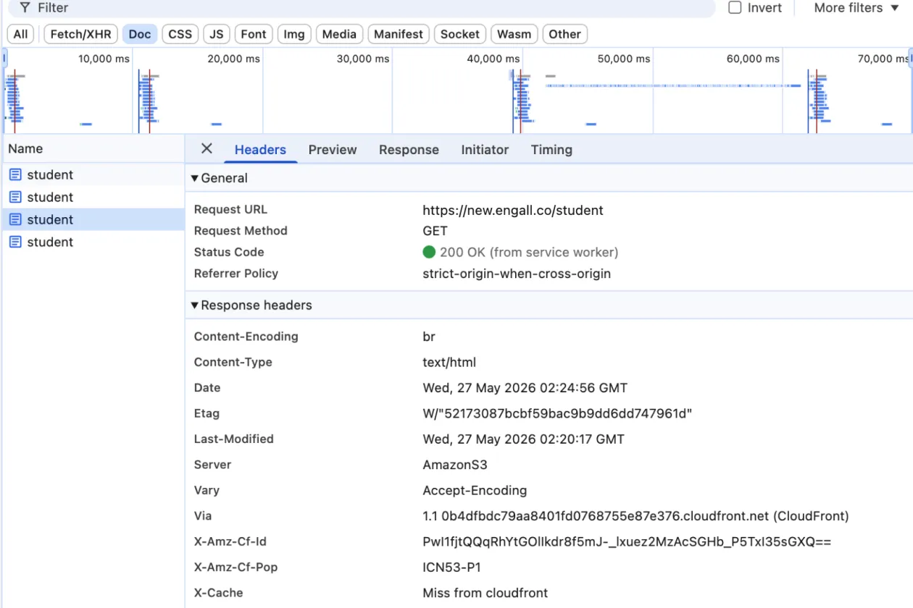
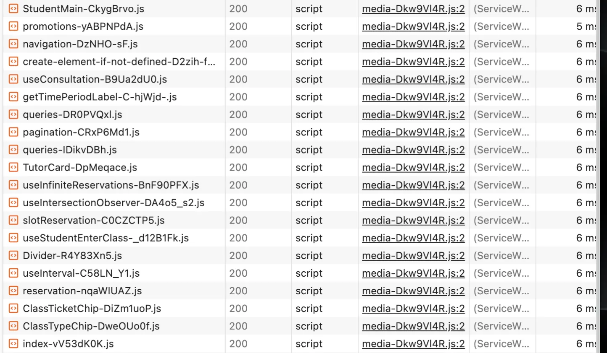
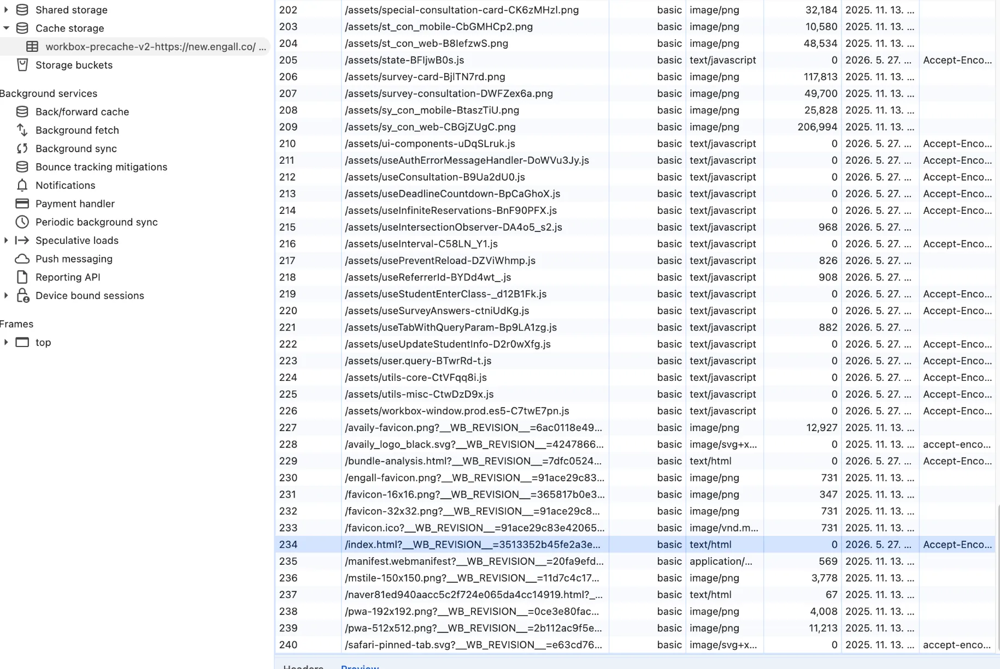
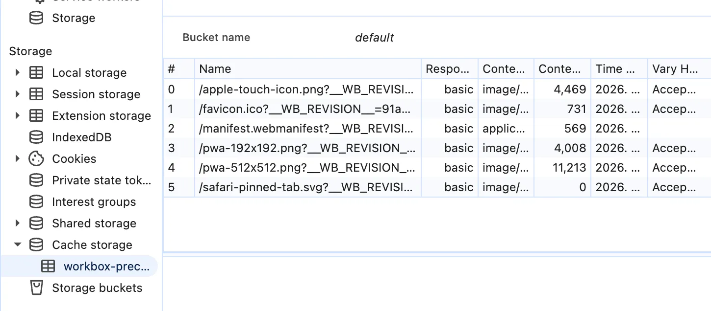

입사 시점부터 알고 있던 이슈 중 하나는, 배포할 때마다 사용자 화면이 강제로 새로고침된다는 점이었습니다. 이 문제를 해결하기 위해 웹 서비스의 캐시 전략을 다시 정리했고, 원인이었던 서비스 워커(Service Worker) 설정을 수정했습니다. 인프라 캐시 레이어를 정돈하고 구조를 최적화한 과정을 정리합니다.

## 1. 배경: 배포 시 강제 새로고침 발생

인수인계 시점에 전임자로부터 전달받은 내용 중 하나는, 배포가 나가면 사용자 화면이 강제로 새로고침된다는 점이었습니다. 원인은 PWA 도입 과정에서 추가된 서비스 워커 때문이라는 설명이었습니다.

이 동작은 사용자 경험(UX) 측면에서 다음과 같은 문제를 만들고 있었습니다.

- **라이브 수업 중 새로고침 발생 가능성**: 1:1 화상 영어 수업 중 배포가 나가면 강제 새로고침이 발생해 수업 흐름에 영향을 줄 수 있었습니다. 이를 막기 위해 코드 레벨에서 새로고침을 차단하는 로직이 추가되어 있었고, 운영상으로도 배포는 주로 수업이 없는 시간대에 진행되고 있었습니다.
- **작성 중인 데이터 유실**: 튜터가 수업 피드백을 작성하는 도중 배포가 겹치면 작성 내용이 사라지는 문제가 있었습니다. 이로 인해 새로고침 방지 팝업과 자동 저장 등 보완용 코드가 누적되어 있었습니다.

근본 원인인 강제 리로드를 그대로 둔 상태에서 화면 쪽 증상만 막는 코드가 여러 곳에 추가되어 있는 구조였습니다. 다만 PWA 설치 기능이 서비스 워커에 의존하고 있었기 때문에, 서비스 워커 자체를 제거하는 방식으로 접근할 수는 없었습니다.

## 2. 사용량 측정과 1차 임시 조치

먼저 현재 PWA가 실제로 얼마나 사용되고 있는지 데이터로 확인했습니다. 측정 결과, PWA를 통한 진입은 하루 10명 미만으로 매우 적었습니다.

구조 개편 전, 활성 세션 중 발생하는 강제 리로드를 최소화하기 위해 기존 코드를 분석했습니다. 당시 `App.tsx`에는 1시간마다 서비스 워커 업데이트를 폴링하는 코드가 있었습니다.

```js
// App.tsx: 1시간 주기로 서비스 워커 업데이트 폴링
const intervalMS = 60 * 60 * 1000;
useRegisterSW({
  onRegistered(r) {
    r &&
      setInterval(() => {
        r.update();
      }, intervalMS);
  },
});
```

이 주기적 업데이트 확인 로직을 제거하고, 서비스 워커 등록 시점을 초기 부트스트랩 단계인 `main.tsx`로 옮겨 진입 시 1회만 등록되도록 수정했습니다.

```js
// main.tsx: 부트스트랩 단계에서 1회만 등록하도록 변경
registerServiceWorker();
```

이 조치로 화면이 갑자기 새로고침되는 빈도는 줄어들었습니다. 다만 임시 조치였기 때문에 한계는 명확했습니다.

배포 후 사용자가 페이지를 직접 새로고침하거나 탭을 다시 열면, 브라우저가 백그라운드에서 새 서비스 워커를 다운로드합니다. 새 서비스 워커가 활성화되는 시점에 화면이 한 번 더 새로고침되는 동작은 그대로 남아 있었습니다.

즉, 자동 새로고침이 발생하는 시점만 뒤로 미뤘을 뿐, 불필요한 이중 리로드는 해결되지 않은 상태였습니다. 배포 신선도와 안정성을 모두 확보하려면 서비스 워커의 내부 설정을 다시 검토할 필요가 있었습니다.

## 3. 캐시 정책 정리 (Cache-Control)

원인 파악에 앞서, 캐시 정책부터 다시 정리하기로 했습니다. [토스 기술 블로그의 웹 캐싱 전략](https://toss.tech/article/smart-web-service-cache)을 참고해, AWS S3 객체의 Cache-Control 헤더와 CloudFront 캐시 동작 정책(Cache Behavior)을 정리했습니다.

### 캐시 정책 설계


기존 응답 헤더에는 `Cache-Control`이 설정되어 있지 않았습니다. 브라우저의 HTTP 캐시 정책이 명확하지 않은 상태였고, 서비스 워커가 별도 캐시 레이어로 동작하고 있었습니다.

캐시 정책을 정하기 위해 자원을 두 부류로 분류했습니다.

**1. 자주 바뀌고 항상 최신이어야 하는 자원: `index.html`**

SPA의 진입점인 `index.html`은 빌드할 때마다 내부에서 참조하는 JS/CSS 해시 파일명이 달라집니다. 즉, `index.html`이 "어떤 청크를 로드할지"를 가리키는 매니페스트 역할을 합니다. 이 파일이 캐시에 오래 남아 있으면, 사용자는 새로 배포된 청크를 받지 못합니다. 따라서 **브라우저 캐시는 짧게, CDN 캐시는 길게 가져가되 배포마다 무효화(Invalidation)** 하는 비대칭 전략이 필요했습니다.

**2. 한 번 생성되면 변경되지 않는 자원: 해시 파일명을 가진 JS/CSS/이미지**

Vite 빌드는 모든 청크에 콘텐츠 해시를 붙입니다(`index-B8pct63T.js`). 파일 내용이 한 글자라도 바뀌면 파일명도 바뀌므로, 같은 URL에서 다른 내용이 내려올 가능성이 없습니다. 이런 자원은 재검증이 불필요합니다.

이 분류를 기준으로 정리한 캐시 정책은 다음과 같습니다.

| 파일 유형                       | 전략                                            | 이유                                                                                  |
| ------------------------------- | ----------------------------------------------- | ------------------------------------------------------------------------------------- |
| index.html                      | `max-age=0, s-maxage=31536000, must-revalidate` | 브라우저는 매 요청 시 재검증, CDN은 1년간 보유하되 배포 시 Invalidation으로 일괄 갱신 |
| JS/CSS (Vite 빌드)              | `public, max-age=31536000, immutable`           | 파일명에 해시 포함 → 내용이 바뀌면 파일명도 바뀌므로 영구 캐시가 안전                 |
| 정적 에셋 이미지 (로고, 아이콘) | `public, max-age=31536000, immutable`           | 변경 시 파일명/경로가 함께 변경되므로 동일하게 장기 캐시                              |

각 디렉티브의 역할을 정리하면 다음과 같습니다.

- `max-age=N`: 브라우저가 N초간 재검증 없이 캐시를 사용 (브라우저 캐시 TTL)
- `s-maxage=N`: CDN 같은 공유 캐시가 N초간 보유 (`max-age`보다 우선 적용)
- `must-revalidate`: 만료된 캐시는 반드시 서버 재검증 후 사용
- `immutable`: 유효 기간 내에는 사용자가 새로고침을 눌러도 재검증 요청을 보내지 않음

특히 `immutable`은 체감 성능에 직접적인 영향을 줍니다. 이 키워드가 없으면 사용자가 새로고침할 때마다 브라우저가 캐시된 자원에 대해서도 `304` 확인 요청을 보내고, 그만큼의 네트워크 왕복이 발생합니다. 해시 파일명 자원에 `immutable`을 설정하면 이 왕복이 제거됩니다.

S3 동기화와 CloudFront 응답 헤더는 다음과 같이 설정했습니다.

```yaml
# 파일명에 빌드 해시가 포함된 정적 자원 — 1년 캐시 + 재검증 생략
--cache-control "public, max-age=31536000, immutable"

# index.html 등 진입점 — 브라우저는 매번 재검증, CDN은 1년 보유 후 배포 시 무효화
--cache-control "max-age=0, s-maxage=31536000, must-revalidate"
```

여기서 한 가지 짚어둘 점이 있습니다. `index.html`의 `max-age=0`은 "매번 전체를 다시 다운로드한다"는 의미가 아니라 **"매번 서버에 재검증을 보낸다"** 는 의미입니다. 파일 내용이 동일하면 CloudFront가 `304 Not Modified`로 본문 없이 응답하므로 캐시를 재사용합니다. 본문이 실제로 다시 내려오는 시점은 배포 후 Invalidation이 일어난 직후 한 번입니다.

이를 그림으로 정리하면 다음과 같습니다.

```Plaintext
                  브라우저 캐시           CDN 캐시
                  ─────────────         ──────────────
index.html        max-age=0             s-maxage=1년 + 배포 시 Invalidation
                  (매번 재검증)            (엣지에서 응답, 배포 시 갱신)

/assets/*.js      immutable             s-maxage=1년
                  (영구 재사용)            (영구 재사용)
```

요약하면, **변경되지 않는 자원은 재검증 없이 그대로 사용하고, 변경 가능한 자원만 최소 단위로 확인**하는 정책입니다. 이 캐시 정책이 이후 무중단 배포 전략의 기반이 됩니다.

인프라 수준에서 헤더를 적용했으니 리소스 사용량과 신선도 모두 개선될 것으로 기대했지만, 실제로는 네트워크 비용이나 로드 속도에 큰 변화가 없었습니다. 설정한 캐시 헤더가 적용되지 않는 원인을 찾기 위해 브라우저 내부 동작을 다시 확인했고, 서비스 워커가 HTTP 캐시보다 상위 레이어에서 요청을 가로채고 있다는 사실을 확인했습니다.

## 4. 서비스 워커 캐시 레이어 확인


개발자 도구의 Network 탭을 보면, 주요 자원이 HTTP 캐시 결과(`304` 또는 `disk cache`)가 아니라 **`(ServiceWorker)`** 상태로 응답되고 있었습니다. 서비스 워커가 HTTP 캐시보다 앞단에서 요청을 가로채는 별도 캐싱 레이어로 동작하고 있었던 것입니다.

사실 자원이 `(ServiceWorker)` 상태로 표시되는 것은 이전부터 보고 있었지만, 서비스 워커의 라이프사이클을 자세히 살펴본 적이 없어, 이 표시가 인프라 캐시 헤더와 어떻게 연결되는지 정확히 이해하지 못하고 있었습니다.

캐시 헤더가 동작하지 않는 이유를 추적하면서, 서비스 워커가 HTTP 캐시보다 앞단에서 모든 요청을 가로채고 있어 헤더 설정이 사실상 의미가 없는 상태였다는 점을 확인했습니다.

```
[화면 요청]
   ▼
[Service Worker]   ← Workbox가 index.html까지 전부 pre-cache (HTTP 캐시 진입 차단)
   ▼ (캐시 미스 시에만 이동)
[브라우저 HTTP 캐시] ← 새로 적용한 Cache-Control
   ▼
[CloudFront CDN]
   ▼
[S3]
```

기존 설정은 VitePWA의 workbox 플러그인을 통해 빌드 산출물 폴더의 모든 자원을 사전 캐싱(precache)하도록 되어 있었습니다.

```ts
VitePWA({
  registerType: "autoUpdate",
  workbox: {
    globPatterns: ["**/*.{js,css,html,ico,png,svg}"], // index.html 포함 모든 파일 대상
  },
});
```


Cache Storage를 확인해 보니 수백 개의 자바스크립트 청크 파일과 함께 `index.html`이 함께 저장되어 있었습니다. 빌드 분석용 파일이나 네이버 사이트 소유 인증용 HTML처럼 캐싱이 필요 없는 일회성 자원도 포함되어 있었습니다. 인프라에 적용한 Cache-Control 헤더는 이 상위 레이어에 가려져 동작하지 않는 상태였습니다.

결과적으로 배포 신선도를 결정하는 부분은 HTTP 캐시가 아니라 서비스 워커의 라이프사이클이었습니다. 배포 시 소스 코드가 바뀌면 빌드 해시 자산이 변경되고, 이에 따라 서비스 워커 파일(`sw.js`)의 내용도 매번 변경됩니다. 브라우저는 서비스 워커가 변경된 것을 감지하면 이를 교체(Update)하는데, 이 과정에서 화면 새로고침이 발생하고 있었습니다.

## 5. 구조 개선: 사용량 대비 비용 재검토

엔지니어링 관점에서 이 구조의 비용과 편익을 다시 계산했습니다.

- **편익**: 오프라인 지원이나 API 캐싱 같은 추가 기능은 사용하고 있지 않았고, PWA 설치 기능만을 위해 유지되고 있었습니다. 설치 사용자는 하루 10명 미만이었습니다.
- **비용**: 전체 사용자가 캐시 레이어의 불투명함, 배포 신선도 저하, 강제 새로고침을 경험했고, 이를 보완하기 위한 코드가 누적되어 있었습니다.

소수의 설치 사용자를 위해 전체 사용자가 복잡성과 품질 저하 비용을 부담하는 구조였습니다. 여기서 중요한 점은 'PWA 설치 가능 상태를 만드는 것'과 '모든 자산을 사전 캐싱하는 것'은 별개의 문제라는 것입니다. 브라우저가 PWA 설치를 허용하는 조건은 유효한 fetch 이벤트 핸들러를 가진 서비스 워커가 등록되어 있는지 여부입니다.

이에 따라 설치 기능은 유지하면서 전역 사전 캐싱만 제거하는 방향으로 설정을 변경했습니다.

```ts
VitePWA({
  registerType: "autoUpdate",
  workbox: {
    globPatterns: [], // 자산 사전 캐싱 중단 (캐싱 제어권은 HTTP/CDN으로 일임)
    navigateFallback: undefined, // precache된 index.html이 없으므로 fallback 비활성화
    runtimeCaching: [
      { urlPattern: /.*/, handler: "NetworkOnly" }, // 설치 조건 충족을 위한 단순 통과 핸들러
    ],
    cleanupOutdatedCaches: true, // 기존 사용자 기기에 남아있는 옛 캐시 정리
  },
});
```

### 변경된 서비스 워커의 역할

이 설정으로 서비스 워커는 다음 세 가지 역할만 수행하게 됩니다.

- **설치 조건 충족**: Android Chrome의 PWA 설치 제안을 위한 SW 등록 상태 유지
- **Fetch 핸들러(Passthrough)**: Chromium의 설치 조건인 fetch 이벤트 핸들러를 등록하되, 요청을 네트워크로 그대로 통과시키고 캐싱에는 관여하지 않음
- **필수 리소스 캐싱**: 아이콘과 Manifest 등 6개 파일만 precache하여 설치 환경 유지

반대로 더 이상 수행하지 않는 작업은 다음과 같습니다.

- JS/CSS/`index.html` 캐싱 → HTTP 캐시 및 CloudFront 설정으로 이관
- Navigation 가로채기 → `index.html`을 캐시에서 서빙하지 않고 네트워크 요청으로 처리
- 실제 사용하지 않는 오프라인 기능 → API 캐싱 없이 형식적으로만 존재하던 부분 제거
- SW 라이프사이클에 의존한 앱 버전·신선도 관리 로직 제거

변경 후 요청 흐름은 다음과 같이 정리됩니다.

```
[탭의 fetch 요청]
   ▼
[Service Worker]   ← 아이콘/Manifest 외 모든 요청 통과 (Passthrough)
   ▼
[브라우저 HTTP 캐시] ← max-age / immutable 설정에 따라 작동
   ▼
[CloudFront CDN]   ← s-maxage 설정에 따라 작동
   ▼
[S3]
```

참고로 iOS Safari는 SW 없이 manifest만으로 홈 화면 추가가 가능하지만, Android Chrome의 PWA 설치 제안은 fetch 핸들러를 가진 SW가 필수입니다. 따라서 현재 SW는 Android 환경의 설치 조건을 충족하기 위한 최소 구성이며, 캐싱 정책은 HTTP/CDN 레이어가 담당합니다.

## 6. 검증 및 실측 데이터

### 로컬 검증: 코드 변경 시 서비스 워커 파일의 동일성 여부

소스 코드를 변경하기 전과 후로 각각 빌드를 실행하고, 생성된 `sw.js` 파일의 해시값을 비교했습니다. 이 단계에서 확인하려고 한 건 "실제로 새로고침이 안 일어나는지"가 아니라, "코드를 바꿔도 `sw.js`가 안 바뀌는지"였습니다.

```
[기존 설정] 소스 코드 한 줄 변경 시 서비스 워커 파일이 변경됨
  sw.js sha256: 0a469c… != 39b90e… (일치하지 않음)
  - 원인: 메인 엔트리 파일의 해시값 변경(index-B8pct63T.js -> index-B8Jy3RfD.js)이 서비스 워커 내부의 사전 캐시 목록에 주입되어 sw.js 자체가 변경됨. 매 배포 시 서비스 워커 교체 및 강제 리로드 발생.

[수정 후 설정] 소스 코드 변경 시에도 서비스 워커 파일이 동일함
  sw.js sha256: 5a6aae… = 5a6aae… (일치)
  - 원인: 캐시 목록이 비어 있어 프로젝트 코드가 변경되어도 서비스 워커의 내용은 변하지 않음. 서비스 워커 교체가 발생하지 않으므로 강제 새로고침도 발생하지 않음.
```

`sw.js`가 그대로면 업데이트가 트리거되지 않습니다. 다만 이건 빌드 결과물끼리 비교한 거라, 실제 화면에서 새로고침이 안 일어나는지는 다음 스테이징 단계에서 따로 확인했습니다.

### 스테이징 환경 실측 결과

수정한 인프라 구성을 스테이징 환경에 배포하고 개발자 도구에서 수치를 측정했습니다.



개선 결과는 다음과 같습니다.

- Cache Storage 등록 리소스 수: 약 240개 → 6개 (-97.5%)
- 서비스 워커 번들 크기: 14,555 bytes → 1,168 bytes (-92.0%)

이로써 인프라에 설정한 Cache-Control 헤더가 의도한 레이어에서 정상 동작함을 확인했습니다. 파이프라인에 추가한 CDN 캐시 무효화 작업도 안정적으로 동작했습니다.

## 7. 사용자 경험의 변화

스테이징 검증을 마치고 상용 환경에 배포를 완료했습니다. 그간 유지되어 오던 배포 시 강제 새로고침 동작이 제거되었습니다.(드디어..!)

### 신선도 관리 주체의 이관

가장 큰 변화는 앱 신선도를 관리하는 레이어가 변경되었다는 점입니다.

- **변경 전**: 앱 신선도가 SW 업데이트(Precache 갱신)에 의존 → SW 교체 전까지 구버전이 서빙되고, 교체 시점에 강제 새로고침 발생
- **변경 후**: 신선도 관리가 HTTP/CDN 캐시(`max-age=0` + Invalidation)로 이관 → SW 교체 여부와 무관하게 사용자가 새로고침하거나 새 페이지로 진입하면 최신 `index.html` 요청 → 이미 열린 세션은 명시적으로 종료하지 않음

### 배포에서 사용자 적용까지의 단계

```txt
1. 빌드
   - 코드 변경 → 해시가 포함된 새 파일명 생성 (ContentsPage-AAA.js → ContentsPage-BBB.js)
   - 변경된 파일을 참조하는 새 index.html 생성

2. 배포
   - 새 해시 자산을 S3에 업로드 (기존 청크는 삭제하지 않고 보존)
   - 새 index.html 업로드
   - CloudFront Invalidation 실행 → 엣지의 기존 index.html 캐시 제거

3. 사용자 적용
   - 사용자가 index.html을 다시 요청하는 시점에 새 버전 로드
```

### 사용자 상태별 업데이트 시점

| 사용자 상태                | 작동 방식             | 최신 버전 적용 시점 |
| -------------------------- | --------------------- | ------------------- |
| 새로고침 / 새 탭 / 새 진입 | 전체 페이지 로드      | 즉시 최신 버전 적용 |
| 진행 중인 SPA 세션         | 메모리 기반 화면 전환 | 다음 새로고침 시점  |

`index.html`의 `max-age=0`은 매 요청 시 재검증을 보장하므로 Invalidation된 최신 `index.html`을 받아 새 청크를 로드합니다. 반면 React Router 기반 SPA 내비게이션은 `index.html`을 다시 요청하지 않습니다.

또한 배포 시 기존 청크 파일을 삭제하지 않고 유지하므로, 기존 세션이 이전 청크를 참조하더라도 chunk-load 에러 없이 동작합니다.

### 배포 후 확인된 변화

상용 적용 이후 확인된 변화는 다음과 같습니다.

- **수업 중 새로고침 미발생**: 1:1 화상 수업 시간대에 배포가 진행되어도 학생/튜터 화면이 새로고침되지 않음 → 운영 시간 제약 해소
- **튜터 작성 데이터 유지**: 피드백 작성 중 배포가 겹쳐도 작성 내용 유지 → 새로고침 방지 팝업 및 자동 저장 방어 코드 정리 가능
- **배포 시간대 제약 완화**: 사용자가 적은 시간대를 의도적으로 선택하던 운영 방식 제거

### 트레이드오프: 강제 갱신에서 사용자 주도 갱신으로

이번 변경을 요약하면 배포 반영 방식이 **Push에서 Pull로 전환**된 것입니다.

- **변경 전 (Push)**: 서비스 워커를 통한 강제 새로고침
  - 장점: 모든 사용자에게 즉시 업데이트 적용
  - 단점: 수업 중 사이트가 새로고침 될 가능성 존재, 작성 중 데이터 유실 등 사용자 경험 저하

- **변경 후 (Pull)**: 사용자의 다음 액션 시점에 맞춰 반영
  - 장점: 배포 중에도 열려 있는 세션이 끊기지 않음 → 배포 안정성 확보
  - 단점: 열려 있는 탭은 자동으로 최신 상태가 되지 않음 → 긴급 핫픽스 시 별도 안내 배너 또는 명시적 리로드 전략 필요

결과적으로 `sw.js`는 PWA 설치 조건을 만족시키는 최소 역할만 수행하고, 배포 신선도와 캐싱 정책은 HTTP/CDN 레이어가 담당하게 되었습니다. 사용자는 다음 실제 로드(새로고침, 새 탭, 새 진입) 시점에 자연스럽게 최신 버전을 받습니다.

## 8. 회고

- **캐시 정책보다 캐시 권한이 먼저였다**  
  처음에는 Cache-Control 헤더를 올바르게 설정하면 문제가 해결될 것이라 생각했습니다. 하지만 실제 병목은 헤더가 아니라 요청을 먼저 처리하는 레이어에 있었습니다. 캐시 전략보다 먼저, 어느 레이어가 캐시의 권한을 갖는지 이해하는 것이 필요했습니다.

- **증상을 막는 코드가 많다면 공통 원인을 의심해야 한다**  
  새로고침 방지 팝업, 자동 저장, 주기적 업데이트 확인 로직은 서로 다른 문제처럼 보였지만 모두 같은 원인(SW 기반 강제 갱신)에서 파생된 보완 코드였습니다. 비슷한 방어 코드가 반복된다면 개별 수정보다 구조를 먼저 확인해야 한다는 점을 배웠습니다.

- **즉시 반영보다 세션 안정성이 더 중요한 순간이 있다**  
  처음에는 배포 즉시 최신 버전이 적용되는 것이 이상적이라고 생각했습니다. 하지만 현재 서비스에서는 즉시성이 사용자 경험을 해치는 방향으로 작동하고 있었습니다. 이번 변경은 즉시 반영을 일부 포기하는 대신, 사용자가 작업을 끝낼 수 있는 안정성을 선택한 사례였습니다.
