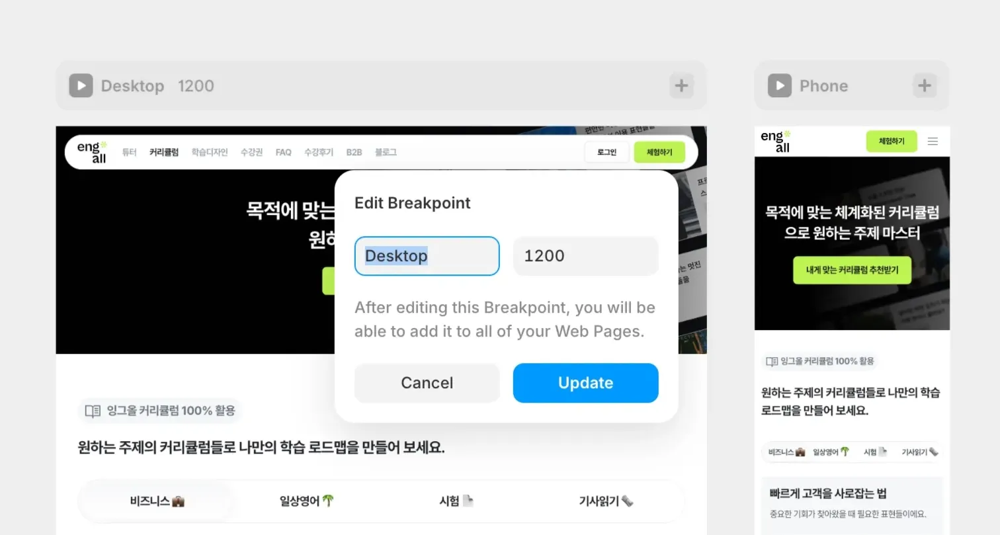
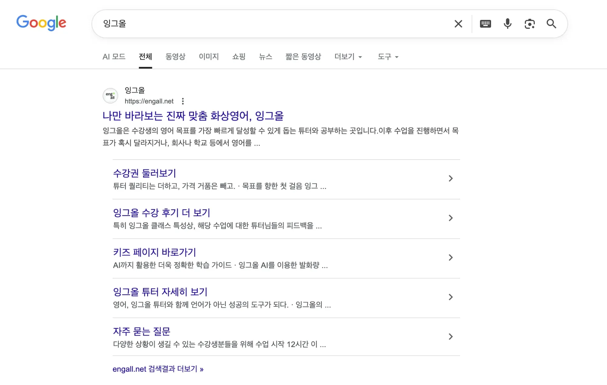
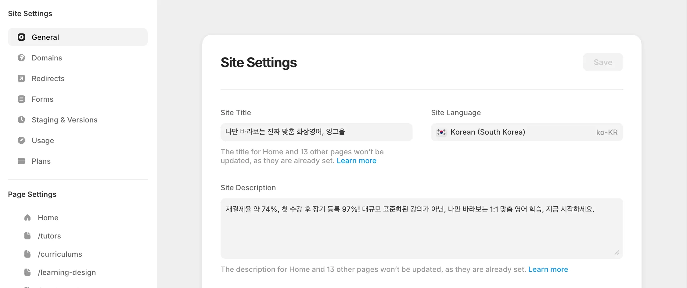
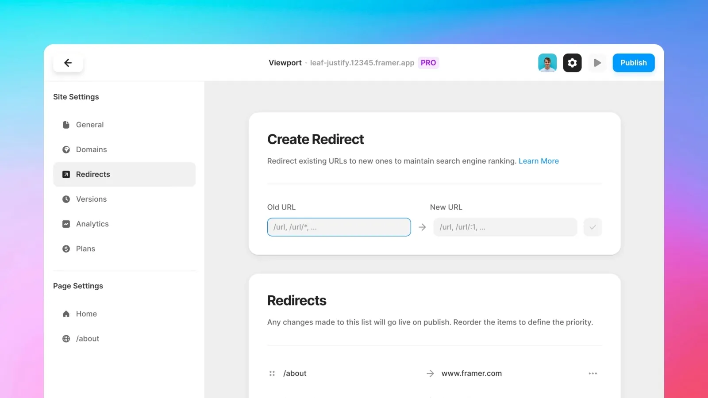
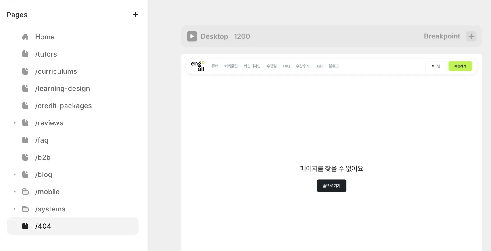
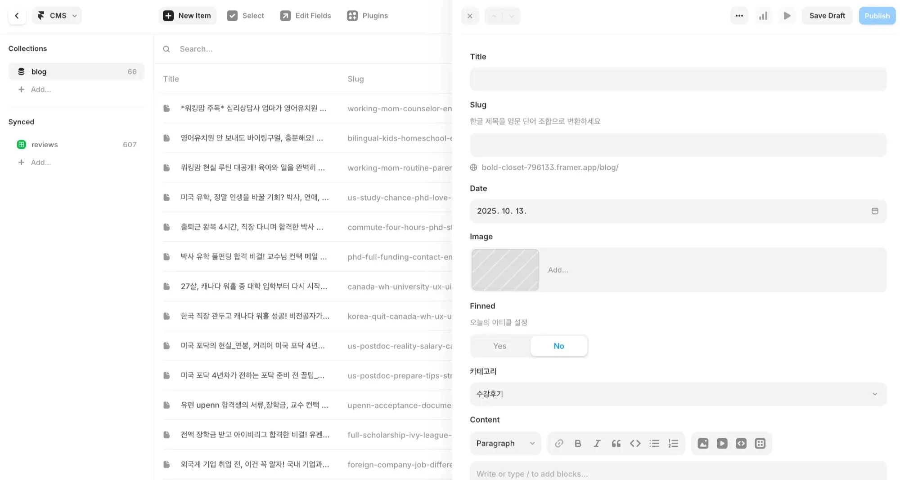
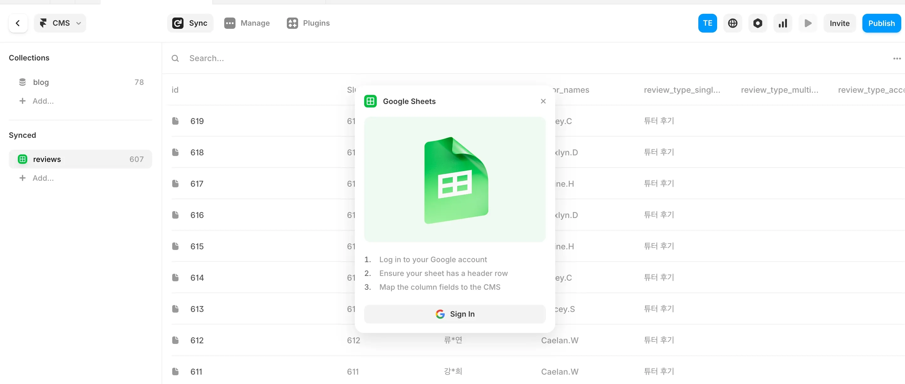
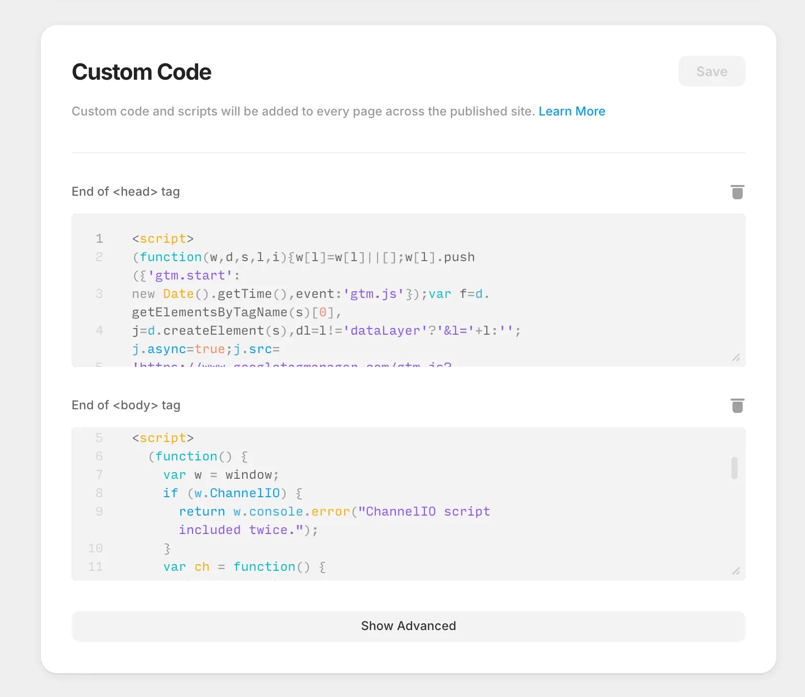
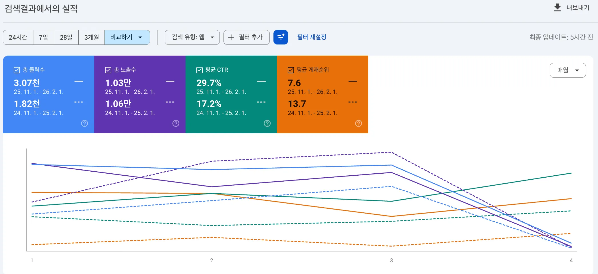

## 전환 배경

잉그올 랜딩 페이지는 이미 Next.js 기반으로 구축되어 있었고, 저는 그 구조를 이어받아 운영하고 있었습니다. 인증이나 복잡한 비즈니스 로직이 없는 정보 전달용 페이지였지만, 문구 하나를 수정하려면 코드 변경과 배포를 거쳐야 하는 구조였습니다.

운영을 이어가면서 한 가지 질문이 생겼습니다. “이 페이지에 지금 구조가 정말 필요한가?”

팀 내부에서도 랜딩 페이지의 역할은 빠르게 실험하고, 메시지를 계속 다듬어가는 데 있다는 공감대가 있었습니다. SEO만 안정적으로 유지할 수 있다면, 프레임워크 의존도를 낮추는 방향이 더 적절해 보였습니다.

그 고민 끝에 약 1개월간 UX/UI 디자이너분과 함께 랜딩 페이지를 Next.js에서 Framer로 전환했습니다.

## 전환 목표

1. 기존 SEO 구조 유지 및 검색 유입 안정화
2. 콘텐츠 제작과 수정의 자율성 확보
3. 개발 리소스를 핵심 서비스에 집중할 수 있는 환경 조성

단순히 기술 스택을 바꾸는 것이 목적이 아니라, 페이지의 성격에 딱 맞는 효율적인 운영 구조를 만드는 것이 핵심이었습니다.

## 기술 선정: 왜 Framer였는가

- 팀 내부에 이미 사용 경험이 있는 팀원이 있었습니다.
- 별도의 빌드 과정 없이 실시간으로 수정 사항을 반영할 수 있습니다.
- SEO 설정 및 트래킹 도구 연동을 제공하여 운영에 필요한 기능을 쉽게 구현할 수 있습니다.
- CMS를 활용해 콘텐츠를 쉽게 확장할 수 있습니다.

빠른 실험과 운영 효율이 최우선이었기에, Framer는 매우 현실적이고 합리적인 선택지였습니다.

## 전환 과정 Step by Step

UX/UI 디자이너 팀원분과 함께 진행한 전환 과정입니다.

### 1. 페이지 구조 재설계와 반응형 전략

Next.js에서는 CSS와 미디어 쿼리 기반으로 반응형을 제어했지만, Framer에서는 Breakpoints 중심의 설계 방식이 구조적으로 더 적합했습니다.

- Breakpoints를 활용해 데스크탑과 모바일 디바이스별 UI를 명확히 분리했습니다.
- 1200px 이상 데스크톱 프레임을 기준으로 기본 설계를 진행했습니다.
- 컴포넌트 단위가 아닌 레이아웃 단위로 반응형을 설계해, 디자이너와의 협업 과정에서도 구조를 이해하기 쉽게 만들었습니다.

별도의 미디어 쿼리 코드를 작성하지 않아도 되어, 유지보수 관점에서도 부담을 줄일 수 있었습니다.

### 2. SEO 설정과 마이그레이션 전략

Framer로 전환하면서 가장 우선순위로 둔 부분은,
기존 검색 노출과 URL 구조를 그대로 유지해 검색 유입이 흔들리지 않도록 하는 것이었습니다.

#### 2-1. Meta 태그 구조 정리

- Global 설정을 통해 공통 메타값을 정의했습니다.
- 페이지별로 Title, Description, OG 태그를 개별 설정하여 관리했습니다.

Global 설정으로 공통 메타값을 관리하면서도, 페이지 단위로 세부 설정이 가능해 캠페인이나 콘텐츠 성격에 맞는 SEO 대응이 가능했습니다.

#### 2-2. URL 구조 유지

- 기존 수강후기 상세 페이지는 `/review/:id` 형태의 URL 구조로 되어 있었습니다.
- Framer 전환 시에도 실제 데이터의 id 값을 그대로 사용하여 동일한 `/review/:id` URL 패턴을 유지했습니다.

실제 수강후기의 id 값을 그대로 사용해야 했기 때문에, Google Spreadsheet Sync 기능을 활용해 데이터를 연결했습니다. (자세한 내용은 다음 섹션에서 설명합니다.)

이렇게 함으로써 기존에 검색엔진에 인덱싱되어 있던 URL이 깨지지 않도록 했습니다.

페이지 Route 이름 또한 기존과 동일하게 설정하여, 기존 링크가 유지되도록 구성했습니다.  
그 결과, 외부 마케팅 링크나 기존 검색 결과에 대해 추가 리다이렉트 작업을 거의 하지 않아도 되었습니다.

#### 2-3. Redirect 기능 활용

Framer에서는 Redirect 기능을 활용해 기존 URL을 새로운 구조로 연결할 수 있습니다.

기존 Next.js 환경에서는 블로그 URL이 내부 path 기준으로 생성되어 SEO 관점에서 다소 아쉬운 구조였습니다.  
블로그 CMS를 새로 구축하면서 slug 기반 구조로 개편해 URL에 의미를 부여했습니다.

예: 제목에 "박사 유학 풀펀딩"이라는 텍스트가 포함된 포스트라면  
`/blog/post/phd-full-funding` 형태의 URL을 가지도록 설계했습니다.

기존 검색 결과를 통해 유입되는 트래픽이 자연스럽게 새로운 블로그 구조로 연결되도록 Redirect 기능을 설정했습니다.

#### 2-4. 404 페이지 설정

Framer에서 Pages 폴더에 `/404` 페이지를 생성하면 자동으로 404 페이지로 설정됩니다.  
잘못된 URL 접근 시에도 사용자 경험이 단절되지 않도록 기본 구조를 설계했습니다.

### 3. CMS 설계와 운영 구조 정리

운영팀이 개발 의존 없이 콘텐츠를 관리할 수 있도록 CMS 설계를 중요한 과제로 설정했습니다.

블로그나 뉴스 피드처럼 목록 → 디테일 페이지 구조를 구현할 때,  
Framer CMS 기능을 활용하면 별도 개발 없이도 손쉽게 구축할 수 있습니다.

#### 3-1. Framer CMS Collection 구성

- ‘목록 → 상세 템플릿’ 구조로 체계화했습니다.
- 서비스 기획 의도에 맞춰 필드(Field)를 정의했습니다.
- 초안 작성(Draft)부터 발행(Publish)까지의 프로세스로 관리할 수 있도록 구성했습니다.

이제 마케터는 개발자의 도움 없이도 직접 콘텐츠를 수정하고 발행할 수 있습니다.  
외부 플랫폼에 흩어져 있던 콘텐츠를 자사 도메인 중심으로 모을 수 있었던 점이 가장 의미 있는 변화였습니다.

#### 3-2. Google Spreadsheet Sync 기능 활용

Framer CMS는 Sync 기능을 통해 Notion, Google Spreadsheet 등 다양한 외부 서비스와 동기화할 수 있습니다.

이를 활용해 수강후기 페이지에 필요한 데이터를 관리했습니다.  
실제 수강후기 데이터는 백엔드 데이터와의 동기화가 필요했기 때문에 추가 설계가 필요했습니다.

- 백엔드 데이터가 주기적으로 구글 스프레드시트에 업데이트되도록 구성했습니다.
- 데이터가 JSON 객체 형태로 내려오는 경우, Framer CMS에서 바로 파싱하기 어려운 부분이 있어 **백엔드에서 필요한 필드만 가공해 내려주는 구조**로 설계했습니다.
- 이 과정에서 실제로 필요한 데이터 필드(예: `id`, `title`, `createdAt` 등)를 명확히 정의하기 위해 프론트엔드–백엔드 간 명세 커뮤니케이션이 필수적이었습니다.
- CMS가 해당 시트의 데이터를 동기화합니다.
- 최종적으로 Framer 페이지 내 요소들에 데이터를 바인딩했습니다.

운영 과정에서 아쉬운 점도 있었습니다.  
리뷰 데이터가 업데이트되면 누군가는 CMS에서 Sync 버튼을 눌러 데이터를 동기화한 뒤, Publish 버튼을 통해 다시 배포해야 합니다.

노코드 툴의 장점을 충분히 활용하고 있는지에 대해서도 한 번 더 고민하게 되었습니다.  
다만 현재는 1–2일 주기로 한 번만 동기화하면 되는 구조라 운영상 큰 부담은 없다고 판단해 유지하고 있습니다.

### 4. 트래킹 스크립트 설정

Framer의 Custom Code는 사이트 설정에서 HTML/JS/CSS 스니펫을 `<head>` 또는 `<body>`에 삽입해 외부 스크립트를 실행할 수 있도록 해주는 기능입니다.

운영에 필요한 GA4, 채널톡 등 외부 트래킹 툴을 Custom Code 영역에 직접 삽입했습니다.  
별도의 빌드·배포 과정 없이도 마케팅 툴을 연동할 수 있어, 캠페인 성과를 빠르게 확인하고 실험을 반복할 수 있는 환경을 만들었습니다.

## 전환 이후의 변화

전환 이후 가장 먼저 체감한 변화는 운영 속도였습니다. 운영 주체가 개발자에서 콘텐츠 담당자로 자연스럽게 이동했고, 배포 중심 구조에서 실시간 수정 중심 구조로 바뀌었습니다.

- **랜딩 문구 수정 평균 소요 시간**  
  1~2일 → 30분 이내

- **월 평균 랜딩 수정 요청 (개발 개입 기준)**  
  8~10건 → 0건

SEO 지표에서도 의미 있는 변화가 나타났습니다.

- **자연 검색 유입 (최근 3개월, 전년 동기 대비)**  
  총 클릭수: 1,820 → 3,070 (▲ 1,250)  
  총 노출수: 10,600 → 10,300 (▼ 300)  
  평균 CTR: 17.2% → 29.7% (▲ 12.5%p)  
  평균 게재순위: 13.7 → 7.6 (▲ 6.1 개선)

노출수는 소폭 감소했지만, 평균 게재순위가 개선되면서 클릭 수가 유의미하게 증가했습니다.  
단순 노출 확대보다 검색 의도에 맞는 유입 비중이 높아진 것으로 해석하고 있습니다.

또한 외부 플랫폼 중심이던 콘텐츠 발행 구조를 내부 블로그 중심으로 전환하면서, 검색 유입을 자사 도메인에 축적할 수 있게 되었습니다.

프론트엔드 관점에서는 운영성 반복 작업이 구조적으로 분리되었다는 점이 가장 큰 변화였습니다. 그만큼 핵심 서비스 개선에 더 많은 시간을 투입할 수 있는 환경이 만들어졌습니다.

## 마무리

이번 전환 작업은 단순히 디자인 툴을 바꾸는 일이 아니라,  
SEO 구조, URL 체계, 콘텐츠 운영 방식까지 다시 정리하는 과정이었습니다.

Framer는 노코드 툴이지만, 실제 운영 환경에서는 구조 설계와 데이터 흐름에 대한 이해가 함께 필요하다는 점을 느꼈습니다.  
특히 SEO 안정성을 유지하면서 CMS 기반으로 운영 전환을 이뤄낸 경험은 개인적으로도 의미가 있었습니다.

다음 편에서는 Framer 환경에서 커스텀 컴포넌트를 제작하고 API를 연동한 과정,  
노코드 툴로 전환하면서 마주했던 기술적 한계, 그리고 전체 프로젝트를 통해 느낀 점을 정리해보겠습니다.
