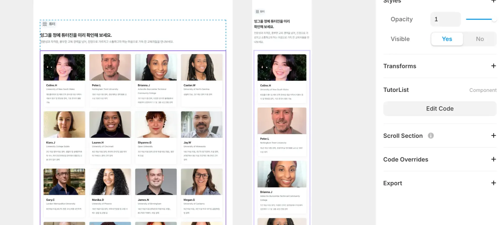
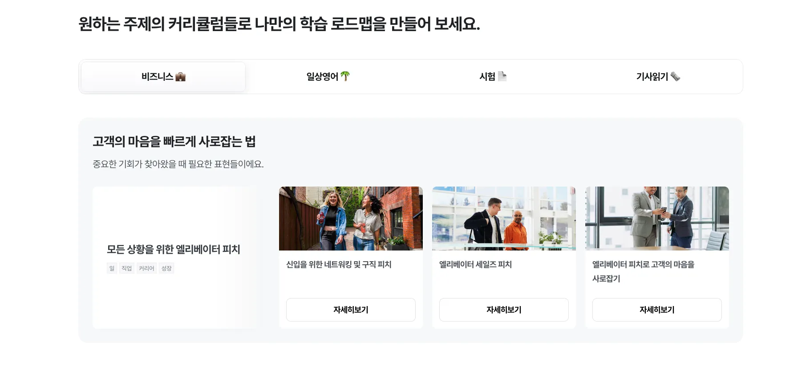
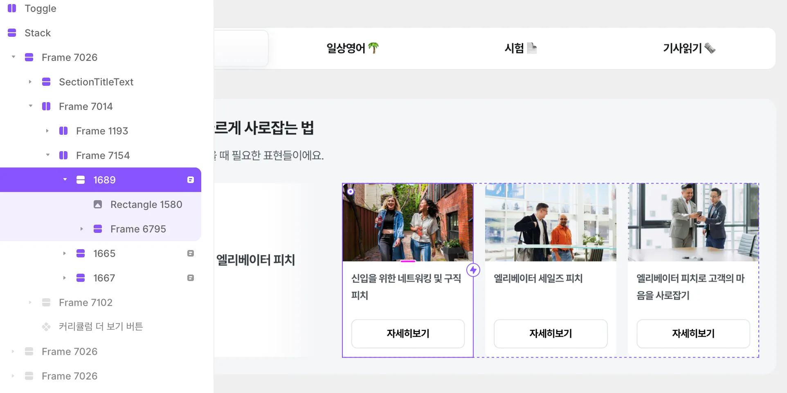
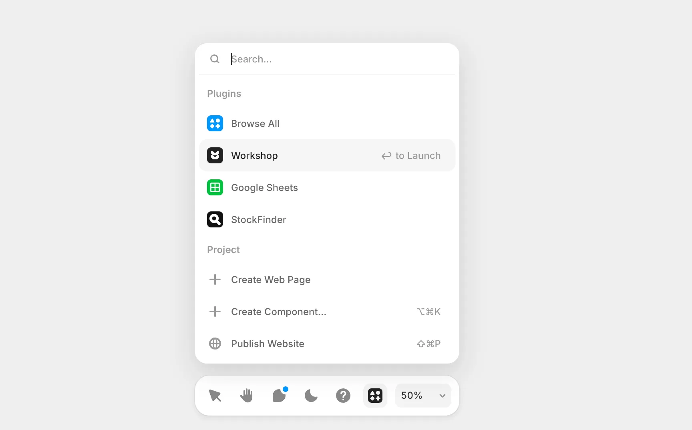

## Framer에서 커스텀 컴포넌트와 API 연동

1편에서는 Framer로 전환하며 SEO 구조와 CMS 운영 방식을 정리했던 과정을 다뤘습니다.  
이번 글에서는 Framer 환경에서 API를 연동하며 구현했던 두 가지 서로 다른 방식과, 그 과정에서 마주했던 기술적 제약을 정리해보겠습니다.

---

## 1. 튜터 페이지 — 커스텀 컴포넌트 기반 설계



튜터 목록은 설계 단계부터 동적 데이터를 전제로 한 구조였습니다.

- 튜터가 신규로 추가될 수 있고
- 튜터 상태 변경이 발생할 수 있으며
- 운영 정책에 따라 노출 조건이 달라지는 구조였습니다

이 특성상 정적인 디자인 요소로는 관리가 어려웠고, 처음부터 커스텀 컴포넌트 기반으로 설계하는 방식을 선택했습니다.

### 구조

- Tutor List 커스텀 컴포넌트에서 목록 API 호출
- 응답 데이터를 기반으로 Tutor Card 렌더링
- 카드 클릭 시 선택된 튜터 데이터를 상태로 저장
- Detail Modal에 props로 데이터 전달

중요한 점은 디테일 모달에서 별도의 id 기반 API 호출을 하지 않았다는 것입니다.  
튜터 목록 API 응답에 필요한 데이터가 포함되어 있었기 때문에, 선택된 튜터 객체를 그대로 모달에 내려보내는 구조로 설계했습니다.

데이터 흐름은 다음과 같습니다.

```plaintext
Tutor List API 호출
      ↓
Tutor Card Render
      ↓
Card 클릭 이벤트 발생
      ↓
Selected Tutor 상태 저장
      ↓
Tutor Detail Modal (props로 데이터 전달)
```

이 방식은 일반적인 React 기반 사고와 유사했고, Code Override 없이도 자연스럽게 구성할 수 있었습니다.

---

## 2. 커리큘럼 페이지 — 디자인 중심 구조에서의 확장



반면 커리큘럼 페이지 리스트는 접근 방식이 달랐습니다. 이 영역은 디자인 요소가 강하게 반영되어 있었고, 처음부터 커스텀 컴포넌트로 설계된 구조가 아니었습니다.

- 디자이너가 Framer의 디자인 Frame 기반으로 리스트 구성
- 각 콘텐츠 아이템이 디자인 레이어 단위로 존재

문제는 콘텐츠 클릭 시 발생했습니다.  
디테일 모달을 열어야 했고, 모달에서는 `/content/:id` 형태의 Detail API 호출이 필요했습니다.

하지만 디자인 Frame 기반 구조에서는 React처럼 자연스럽게 id를 props로 전달하는 경로가 존재하지 않았습니다.

---

## 3. Code Override를 활용한 동적 파라미터 전달

처음에는 일반적인 React 방식처럼 props를 통해 id를 전달하려고 했습니다.
하지만 Framer의 디자인 Frame 구조에서는 컴포넌트 간 데이터 전달 경로가 존재하지 않았습니다.

라우팅 방식으로 해결할 수 있는지도 확인해봤지만, Framer 환경에서는 페이지 라우팅과 디자인 레이어가 분리되어 있어 이 방식 역시 적용하기 어려웠습니다.

결국 디자인 레이어의 메타 정보를 활용하는 방법을 고민하게 되었고, Frame의 name 값을 id로 사용하는 방식으로 문제를 해결했습니다.



### 구현 방식

- 각 콘텐츠 Frame의 이름을 실제 콘텐츠 id 값으로 지정(e.g. `1689`)
- Code Override 함수에서 해당 Frame의 name 값을 읽어옴
- 클릭 이벤트 발생 시 id 값을 상태로 저장
- 모달 렌더링 시 `/content/:id` Detail API 호출

### Override 함수 예시 코드

```tsx
import type { ComponentType } from "react";
import { forwardRef, useState } from "react";
import ContentDetailModal from "https://framer.com/m/ContentDetailModal-MFww.js@nztpDU9WDyW63PZ6uWXF";

export const withCardClick = (Component): ComponentType => {
  return forwardRef((props, ref) => {
    const [selectedContentId, setSelectedContentId] = useState<number | null>(
      null,
    );

    const onTap = () => {
      // props에 포함된 'data-framer-name' (레이어의 frame 이름)을 ID로 사용합니다.
      const layerName = props["data-framer-name"];

      if (layerName) {
        setSelectedContentId(Number(layerName));
      } else {
        console.error(
          "Layer has no name. Please name the layer in the Layers panel.",
        );
      }
    };

    const handleClose = () => {
      setSelectedContentId(null);
    };

    return (
      <>
        <Component ref={ref} {...props} onTap={onTap} cursor="pointer" />
        {selectedContentId && (
          <ContentDetailModal
            selectedId={selectedContentId}
            onClose={handleClose}
          />
        )}
      </>
    );
  });
};
```

전체 흐름은 다음과 같았습니다.

```plaintext
Design Frame Click
      ↓
withCardClick Override 실행
      ↓
data-framer-name 값 추출
      ↓
Content ID 상태 저장
      ↓
ContentDetailModal 렌더링
      ↓
Detail API 호출
```

기능적으로는 정상 동작했지만, 디자인 레이어의 이름을 데이터 식별자로 사용하는 방식은  
전통적인 프론트엔드 설계 관점에서는 우회적인 접근이었습니다.

다만 디자인 중심 워크플로우를 유지하면서 동적 데이터를 연결해야 했던 상황에서는 현실적인 선택이었습니다.

---

## 4. 두 방식의 차이 정리

튜터 페이지와 커리큘럼 페이지는 구현 방식이 명확히 달랐습니다.

### 튜터 페이지

- 처음부터 커스텀 컴포넌트 기반 설계
- 목록 API 응답을 props로 전달
- Code Override 불필요
- 비교적 단순한 데이터 흐름

### 커리큘럼 페이지

- 디자인 Frame 기반 구조
- id 전달 경로 부재
- Code Override를 통한 우회적 연결
- 모달 내부에서 Detail API 별도 호출

이 차이는 단순 구현 차이가 아니라, 초기 설계 방향에 따른 아키텍처 차이였습니다.

---

## 5. Import 구조와 개발 환경의 제약

Code Component를 분리해 사용하면서 일반적인 React 개발 환경과의 차이도 체감했습니다.

```tsx
// framer 컴포넌트 import 예시
import CardSlide from "https://framer.com/m/CardSlide-MFww.js@^1.0.0";
```

### 예시

- 자식 컴포넌트를 분리하고 import하여 사용
- 수정 시 변경 사항이 즉시 반영되지 않는 경우 발생
- 재등록 또는 import 정리가 필요한 상황 존재

Framer의 Code Component는 로컬 파일을 직접 import하는 구조가 아니라,
`https://framer.com/m/...` 형태의 Module URL을 통해 컴포넌트를 불러오는 방식입니다.
(참고: [Framer Component Sharing 공식 문서](https://www.framer.com/developers/component-sharing))

이 때문에 일반적인 React 개발 환경에서 경험하는 HMR(Hot Reload)과는 달리 수정 사항이 즉시 반영되지 않는 경우가 있었습니다.

또한 ESLint나 Prettier 같은 포맷팅 도구가 부재하여 코드 관리 측면에서도 제약을 느꼈습니다.  
Framer는 코드 확장이 가능하지만, 완전한 개발 환경이라고 보기는 어렵다는 점을 체감한 부분이었습니다.

---

## 6. Card Slide 구현 — 기본 기능을 넘어서기

튜터 및 커리큘럼 영역 외에도, UI 인터랙션 측면에서 직접 확장해야 했던 부분이 있었습니다.

대표적인 사례가 Card Slide 컴포넌트입니다.

초기에는 Framer 기본 기능으로 슬라이드 구성을 시도했습니다. 하지만 다음과 같은 요구사항을 충족하기 어려웠습니다.

- Prev / Next 버튼 제어
- Auto Slide 기능
- 일정 시간 간격 자동 전환
- 현재 인덱스 상태 관리

일반적인 개발 환경이라면 Swiper와 같은 라이브러리를 활용해
빠르게 해결할 수 있는 기능이었지만, Framer 환경에서는 동일한 수준의 제어가 쉽지 않았습니다.

특히 다음과 같은 부분에서 제약을 느꼈습니다.

- 슬라이드 상태를 외부에서 직접 제어하기 어려움
- 커스텀 인터랙션 로직 추가가 제한적
- 디자인 인터랙션과 코드 로직의 경계가 명확하지 않음

노코드 툴을 사용하고 있었지만, 요구사항이 늘어날수록 구현은 점점 코드 중심 구조로 이동하고 있다는 느낌을 받았습니다.

결국 Code Component로 직접 슬라이더를 구현하는 방향으로 전환하게 되었습니다.

### Workshop 기능을 활용한 커스텀 컴포넌트 구현



Framer의 Workshop은 AI를 활용해 코딩 없이 커스텀 컴포넌트를 제작하는 기능입니다.
자연어로 명세하면 코드를 자동으로 생성해주어 어렵지 않게 컴포넌트를 구현할 수 있었습니다.

- 현재 index 상태 관리
- Prev / Next 버튼 클릭 시 index 변경
- setInterval을 활용한 자동 슬라이드 로직
- 언마운트 시 interval 정리

---

## 마무리

이번 프로젝트에서는 동일한 서비스 안에서도 두 가지 서로 다른 구현 방식을 경험했습니다.

- 커스텀 컴포넌트 중심의 구조적 설계
- 디자인 중심 구조를 코드로 확장한 방식

두 방식의 차이는 단순한 구현 방법의 차이라기보다 초기 설계 방향이 이후 개발 방식에 얼마나 큰 영향을 주는지를 보여주는 사례였습니다.

특히 데이터 흐름을 명확히 설계한 영역에서는 비교적 안정적인 구조를 유지할 수 있었지만,  
디자인 중심으로 시작된 영역에서는 동적 데이터를 연결하기 위해 Code Override나 커스텀 코드가 점점 추가되면서 구조가 복잡해지는 경험을 했습니다.

Framer는 빠르게 UI를 제작하고 페이지를 배포하는 데에는 분명 강점이 있는 도구입니다.  
하지만 서비스 요구사항이 점점 복잡해질수록 **노코드 기반 구조만으로는 해결하기 어려운 지점**들이 나타났습니다.

결국 일부 영역에서는 커스텀 코드가 자연스럽게 섞이게 되었고,  
예상보다 프론트엔드 개발자의 공수가 들어가는 작업이 많아졌습니다.

또 하나 아쉬웠던 점은 운영 자동화 측면이었습니다.  
예를 들어 CMS 데이터와 Google Sheet를 동기화하는 기능이 제공되긴 했지만, 실제 운영 환경에서는 완전한 자동화라고 보기는 어려웠고 일부 과정은 수동 관리가 필요했습니다.

Framer는 빠른 제작과 디자인 중심 워크플로우에는 매우 강력한 도구이지만,  
동적 데이터가 많은 서비스나 복잡한 인터랙션이 필요한 경우에는 **초기 아키텍처 설계와 코드 확장을 함께 고려해야 한다**는 점을 배웠습니다.

결과적으로 이번 프로젝트는 단순히 툴을 바꾼 경험이라기보다,  
디자인 중심 도구와 프론트엔드 개발 사이의 경계를 직접 경험해본 과정이었습니다.

---

> [Framer로 만든 페이지 보러가기](https://engall.net?utm_source=blog&utm_medium=post&utm_campaign=yejin-blog)
