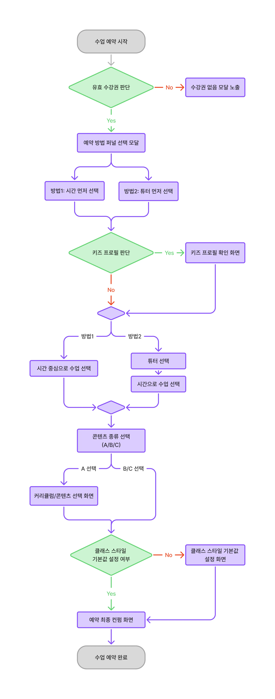

제가 담당하고 있는 화상영어 플랫폼에서 수업 예약은 서비스의 핵심 기능입니다. 수익 구조와 직접 연결될 뿐만 아니라 사용자 경험에도 큰 영향을 주는 영역이기에, 기존 퍼널을 전면 개편하는 일은 적지 않은 부담이었습니다.

하지만 새로운 수업권 체계 도입이라는 요구사항 앞에서, 기존의 파편화된 상태 관리 구조로는 더 이상 대응이 불가능한 한계에 직면했습니다. 단순히 기능을 덧붙이는 것이 아니라 구조 자체를 다시 잡아야 할 시점이라고 판단했습니다.

이 글에서는 토스의 `useFunnel` 라이브러리를 활용해, 복잡하게 얽혀있던 예약 퍼널을 선언적인 구조로 재설계하며 고민했던 과정과 설계 원칙을 공유하고자 합니다.

---

## 기존 예약 퍼널의 문제

### 비즈니스 요구사항 대응의 한계

기존 예약 흐름은 정규 수강권 한 종류만을 처리하도록 설계되어 있었습니다. 하지만 이벤트나 프로모션용 수업권이 추가되면서 기존 구조로는 대응하기 어려운 상황이 되었습니다. 수강권 종류에 따라 서로 다른 크레딧 체계를 적용하거나 선택 옵션을 제한해야 했지만, 기존 코드는 확장을 고려하지 않은 채 구현되어 있었습니다.

분석 결과, 코드 레벨에서 발견된 구체적인 문제점은 다음과 같습니다.

### 1) 파편화된 상태 관리와 추적의 어려움

예약에 필요한 모든 정보가 `reservationState`라는 단일 Atom에 담겨 있었습니다. 필터, 슬롯, 튜터, 수강권 ID 등 11개 이상의 필드가 하나의 객체로 관리되었습니다.

가장 큰 문제는 상태 변경의 주체가 너무 많다는 점이었습니다. `setReservation`이 8개 컴포넌트와 5개 커스텀 훅, 총 36곳에서 호출되고 있었습니다. 데이터가 어느 시점에 어떤 로직으로 변경되었는지 파악하기 어려운 구조였습니다.

### 2) 매직 넘버를 통한 스텝 제어

```tsx
navigate(`/student/reservation/${classTypeName}?step=5`, { replace: true });
```

위와 같이 페이지 이동이 숫자로 관리되어, 기획 변경으로 스텝 순서가 바뀌면 프로젝트 내의 모든 숫자를 찾아 수정해야 했습니다. 또한 스텝을 건너뛰는 조건 로직이 Progress 관련 컴포넌트 두 곳에 중복 정의되어 있어 수정 시 누락이 발생하기 쉬운 상태였습니다.

### 3) 히스토리 관리 부재

모든 이동에 `replace: true` 옵션을 사용하고 있었습니다. 유저는 브라우저 뒤로가기를 사용할 수 없었고, 페이지를 새로고침하면 입력하던 데이터가 사라져 처음부터 다시 시작해야 했습니다. 이는 에러가 발생했을 때 유저가 어느 단계에 머물러 있었는지 로그를 남기는 데에도 제약이 되었습니다.

### 4) 런타임 에러의 잠재적 위험

튜터 목록을 순회하면서 `for` 루프 안에서 `useQuery` 를 호출하는 등 React의 Hooks 규칙을 위반하는 코드가 존재했습니다. eslint-disable로 경고를 우회한 상태였으나, 목록의 길이에 따라 훅 호출 순서가 변할 수 있어 언제든 런타임 에러가 발생할 수 있는 구조였습니다.

---

## 그래서 무엇을 개선하고 싶었나

기존의 문제들을 정리하며 세 가지 개선 방향을 세웠습니다.

1. **스텝의 선언적 관리**: 매직 넘버 대신 의미 있는 이름을 사용하여 흐름을 코드에서 바로 읽을 수 있게 합니다.
2. **브라우저 히스토리 지원**: 새로고침이나 뒤로가기가 사용자 기대대로 자연스럽게 동작하게 합니다.
3. **비즈니스 로직의 주체 정리**: 수강권 검증처럼 정합성이 중요한 판단은 프론트엔드가 직접 수행하지 않고 서버의 응답을 따르도록 합니다.

이 기준을 바탕으로 기술 선택과 설계를 진행했습니다.

---

## useFunnel 도입 과정

### useFunnel을 선택한 이유

[useFunnel](https://use-funnel.slash.page/)은 토스에서 공개한 퍼널 관리 라이브러리입니다. 여러 스텝으로 구성된 UI 흐름을 선언적으로 정의할 수 있으며, 각 스텝 간 상태 전달을 퍼널 컨텍스트로 관리합니다. 특히 라우터와 연동되어 브라우저 히스토리를 자동으로 처리해주므로, 새로고침이나 뒤로가기 대응을 위한 별도 로직이 필요 없다는 점이 큰 장점이었습니다.

처음 알게 된 건 토스 개발자 컨퍼런스 [SLASH 23의 퍼널 설계 발표](https://toss.im/slash-23/session-detail/A1-3)였습니다. 복잡한 분기를 선언적으로 관리한다는 아이디어를 검토하며, 예약 퍼널 재설계에 적합한 도구라고 판단했습니다.

### 직접 구현 대신 라이브러리를 선택한 배경

URL 파라미터로 직접 스텝을 관리하는 방식도 고려했으나, 직접 구현할 경우 다음과 같은 관리 포인트가 발생했습니다.

- **복잡한 스텝과 분기 관리** — 8개의 스텝과 다양한 분기 경로를 `switch`문으로 직접 관리하면 코드가 비대해질 우려가 있었습니다.
- **히스토리 연동 비용** — `pushState`처리나 새로고침 시 상태 복원 로직을 직접 구현하는 것은 공수가 많이 드는 작업이었습니다.
- **타입 안전성** — `useFunnel`은 스텝별 컨텍스트 타입을 추론해주어, 이전 스텝에서 넘긴 데이터를 다음 스텝에서 안전하게 사용할 수 있게 해줍니다.

그래서 직접 샘플을 만들어 조건에 따른 스텝 건너뛰기까지 검증한 뒤 도입을 확정했습니다.

```tsx
type StepName =
  | "kids-profile"
  | "tutor-select"
  | "slot-select"
  | "content-option"
  | "curriculum"
  | "class-style"
  | "final-confirmation"
  | "reservation-complete";
```

숫자 대신 의미 있는 이름으로 관리하니, 코드를 읽는 것만으로도 현재 어떤 흐름인지 파악할 수 있었습니다.

### 상태 관리 방식의 변화

기존에는 전역 Atom에 직접 값을 주입하는 방식이었으나, 도입 후에는 스텝 전환 시 퍼널 컨텍스트로 데이터를 넘기는 방식으로 변경했습니다.

```tsx
// Before: 전역 상태에 직접 set — 어디서든 호출 가능하여 추적이 어려움
setReservation((prev) => ({ ...prev, selectedSlot: slot }));

// After: 각 스텝 컴포넌트에 onNext 콜백을 넘기고 전환 시점에 데이터 전달
<TimeSelect
  step={step}
  context={context}
  onNext={({ selectedSlots }) => handleSlotSelectionNext(selectedSlots)}
/>;
```

각 스텝 컴포넌트가 `onNext`를 통해 다음 단계로 데이터를 넘기는 구조가 되면서, 전역 상태에 의존하지 않고도 흐름을 제어할 수 있게 되었습니다. 데이터의 변경 시점을 추적할 필요 없이 `onNext` 의 흐름만 따라가면 전체 데이터의 전달 과정을 명확히 파악할 수 있게 되었습니다.

---

## 설계 과정의 주요 고민

사실 퍼널 구조 자체보다, 파편화된 분기 조건을 빠짐없이 파악하고 정의하는 과정이 더 어려웠습니다.

### 복잡한 경로의 시각화와 정의

경로가 복잡해진 이유는 단순히 선택지가 많아서가 아니었습니다. 키즈/성인 여부, 시간/튜터 기준 선택, 3가지 콘텐츠 유형, 클래스 스타일 설정 여부 등 여러 조건이 조합되면서 최소 3스텝에서 최대 7스텝까지 다양한 경로가 만들어졌기 때문입니다.

| 시나리오                                         | 경로                                                                            |
| ------------------------------------------------ | ------------------------------------------------------------------------------- |
| 일반 + 시간 먼저 + 콘텐츠 유형 A + 스타일 설정됨 | slot → content-option → final                                                   |
| 일반 + 튜터 먼저 + 콘텐츠 유형 B + 스타일 설정됨 | tutor → slot → content-option → final                                           |
| 키즈 + 튜터 먼저 + 콘텐츠 유형 C + 스타일 미설정 | kids-profile → tutor → slot → content-option → curriculum → class-style → final |
| 튜터 상세 페이지에서 진입                        | slot → content-option → … (tutor-select 스킵)                                   |



코드만으로는 전체 흐름을 파악하기 어려워 퍼널 다이어그램을 직접 그려보았습니다. 시나리오별 경로를 시각화하니 조건 조합에 따라 스텝이 추가되거나 생략되는 케이스를 한눈에 볼 수 있었고, 이는 이후 설계의 중요한 기준점이 되었습니다.

### 예외 진입점 처리

튜터 상세 페이지에서 예약을 시작하는 경우, 튜터를 이미 선택한 상태로 퍼널이 시작되어야 했습니다. 기존에는 전역 상태에 튜터 정보를 직접 주입하는 방식을 사용했습니다.

```tsx
// 기존 방식
return setReservation((prev) => ({
  ...prev,
  reservationType: "tutor",
  selectedTutors: [tutor],
}));
```

재설계 후엔 `tutor-id` 쿼리 파라미터만 추가하는 것으로 충분했습니다. 파라미터 존재 여부에 따라 튜터 선택 스텝을 건너뛰도록 진입점 로직에서 처리함으로써, 퍼널 내부 로직을 건드리지 않고도 예외 진입을 수용할 수 있었습니다.

### 조건부 스텝 스킵

이미 기본값이 설정된 유저나 특정 조건에 해당하지 않는 유저에게는 불필요한 스텝을 노출할 필요가 없었습니다.

- **유저 타입에 따른 스킵**: 성인 유저로 확인될 경우 `kids-profile` 단계를 건너뛰고 바로 다음 단계로 진입합니다.
- **설정값 기반 스킵**: 이미 클래스 스타일 설정을 완료한 유저에게는 해당 퍼널을 생략하여 예약 완료까지의 단계를 단축했습니다.

이처럼 각 스텝마다 "이 유저는 이 단계를 볼 필요가 있는가?"를 명시적으로 정의해야 했으며, 분기 조건을 빠짐없이 수집하고 검증하는 과정이 있었습니다.

---

## 수강권 검증을 서버로 넘기기

기존에는 수강권 선택과 검증 로직이 프론트엔드에 포함되어 있었습니다. 수강권 종류가 다양해지면서 크레딧 계산 방식이나 사용 조건이 복잡해졌고, 이를 프론트엔드에서 관리하다 보니 서버 데이터와 정합성이 맞지 않는 문제가 발생할 가능성이 있었습니다.

이를 해결하기 위해 검증 권한을 서버로 넘겼습니다. 유저가 슬롯을 선택할 때마다 `simulate` API를 호출하고, 응답 결과에 따라 UI를 처리하는 방식입니다.

| 응답 코드                 | 동작                                           |
| ------------------------- | ---------------------------------------------- |
| `NO_PROBLEM`              | 슬롯 선택 추가                                 |
| `ANOTHER_CP_WILL_BE_USED` | 다른 수강권 사용 확인 모달 → 확인 시 선택 추가 |
| `NOT_ENOUGH_CREDITS`      | 크레딧 부족 모달 → 수강권 구매 유도            |
| `HAS_NO_CP`               | 수강권 없음 모달 → 수강권 구매 유도            |
| `ALL_CP_EXPIRED`          | 수강권 만료 모달                               |
| `PAUSED`                  | 일시정지 모달                                  |

이러한 구조 변경을 통해 프론트엔드는 비즈니스 로직의 판단 결과에 따른 UI 렌더링에만 집중할 수 있게 되었고, 검증 로직 수정 시 프론트엔드 코드를 함께 수정해야 하는 번거로움도 사라졌습니다.

---

## 테스트 코드를 통한 신뢰성 확보

분기가 복잡한 만큼 안정성을 확인하기 위해 비즈니스 로직이 집중된 훅과 유틸 함수 위주로 단위 테스트를 작성했습니다.

예를 들어 simulate를 담당하는 훅의 응답 코드에 따른 분기 테스트는 다음과 같이 구성했습니다.

```tsx
describe("수업 선택 시뮬레이션 응답 처리", () => {
  const setupAndTriggerSimulate = (response: SimulateReservationResponse) => {
    // 1. 서버 응답 결과 미리 주입 (Mocking)
    mockSimulateSuccess(response);

    const { result } = renderHook(
      () => useLocalSlotSelection({ isDialogOpen: true, classTypeId: 1 }),
      {
        initializeState: initRecoilState,
      },
    );

    // 2. 특정 슬롯을 선택하여 시뮬레이션 로직 실행
    act(() => {
      result.current.selectSlot(createSlot({ id: 50 }));
    });

    return result;
  };

  it("다른 수강권 사용이 필요한 경우, 관련 안내 모달을 호출한다 (ANOTHER_CP_WILL_BE_USED)", () => {
    setupAndTriggerSimulate({
      case: "ANOTHER_CP_WILL_BE_USED",
      creditPackage: createMockCreditPackage({ id: 1 }),
    });

    expect(mockShowAnotherCpWillBeUsedModal).toHaveBeenCalled();
  });

  it("크레딧이 부족한 경우, 충전 안내 모달을 호출한다 (NOT_ENOUGH_CREDITS)", () => {
    setupAndTriggerSimulate({
      case: "NOT_ENOUGH_CREDITS",
      creditPackage: null,
    });

    expect(mockShowNotEnoughCreditModal).toHaveBeenCalled();
  });

  // ... 나머지 4가지 응답 케이스 생략
});
```

손으로 직접 검증하기 번거로운 슬롯 상태 판정이나 수강권 예외 케이스들을 테스트 코드로 고정해두니, 이후 리팩토링 과정에서도 전체 흐름이 깨지지 않는다는 확신을 가질 수 있었습니다.

---

## 프로젝트를 마치며

배포 직후 가장 먼저 진행한 과정은 직접 서비스를 사용해 보는 '도그푸딩(dogfooding)'이었습니다. 개발자이자 플랫폼의 유저로서 체감한 변화는 분명했습니다. 예약 과정의 속도가 개선되었고, 무엇보다 새로고침을 해도 진행 중인 퍼널이 유지되는 등 사용자 경험이 훨씬 안정적이었습니다.

코드와 구조 측면에서의 변화를 정리하면 다음과 같습니다.

| 항목                              | Before     | After                      |
| --------------------------------- | ---------- | -------------------------- |
| 전역 상태 변경 포인트             | 36곳       | 0곳 (퍼널 컨텍스트로 대체) |
| 스텝 관리 방식                    | 매직 넘버  | 선언적 StepName 타입       |
| 수강권 검증 로직 위치             | 프론트엔드 | 서버 API 위임              |
| 히스토리 지원 (새로고침/뒤로가기) | 불가능     | 자동 지원                  |

에러 대응 방식에도 큰 변화가 있었습니다. 퍼널 단계가 많다 보니, 마지막 단계에서 다른 유저가 먼저 슬롯을 선점하여 에러가 발생하는 경우가 종종 있었습니다. 기존에는 에러 바운더리가 퍼널을 초기화하고 메인 화면으로 돌려보냈지만, 이제는 모달을 통해 상황을 안내하고 퍼널 내에서 슬롯 선택 단계로만 되돌아갈 수 있도록 개선했습니다.

수강권 검증 로직을 서버로 위임하고 단위 테스트를 확보하면서, 코드 수정 시 느꼈던 막연한 불안감도 해소되었습니다. 이후 B2B 수업권이나 체험 수업권 등 새로운 요구사항이 추가될 때도 URL 쿼리 파라미터로 진입점만 다르게 처리할 뿐, 퍼널 내부 로직은 거의 수정하지 않고 대응할 수 있었습니다.

기능을 동작하게 만드는 것을 넘어, 확장 가능한 구조와 안정적인 사용자 경험을 동시에 고민해 볼 수 있었던 유의미한 작업이었습니다.

---

## 번외: 오픈 소스 버그 리포트 경험

구현 과정에서 예상치 못한 현상을 발견했습니다. 퍼널 내부에서 `useNavigate`를 이용해 외부 페이지로 이동하면, 잠시 이동했다가 다시 퍼널의 초기 스텝으로 되돌아오는 문제였습니다.

처음에는 제 코드 로직의 문제라고 판단하여 다양한 시도를 해보았습니다. 하지만 문제를 추적하며 라이브러리 저장소의 이슈 목록을 확인해 보니, 이미 비슷한 증상의 이슈가 보고된 이력이 있었습니다. 이전 버전에서 수정된 것으로 표시되어 있었으나 최신 버전에서도 동일한 현상이 재현되었고, 이를 통해 라이브러리 자체의 문제임을 확신할 수 있었습니다.

이후, 해당 라이브러리 레포지토리에 이슈를 등록했습니다. 증상과 기대 동작, 재현 순서, 그리고 직접 시도해 본 우회 방법까지 포함하여 최소 단위의 재현 예제와 함께 정리했습니다. 감사하게도 메인테이너분들의 빠른 피드백 덕분에 해당 문제는 곧 수정되었습니다.

[[Bug]: 퍼널 단계에서 useNavigate를 이용한 외부 라우팅이 되지 않고 initial step 퍼널로 다시 복귀되는 문제 #138](https://github.com/toss/use-funnel/issues/138)

---

## 마치며

이 작업을 2025년 5월에 배포했고, 약 1년이 지났습니다. 그사이 퍼널과 관련하여 큰 이슈 없이 안정적으로 운영되고 있다는 점에서 이번 재설계의 가치를 체감하고 있습니다.

`useFunnel` 도입 후 가장 큰 변화는 유지보수의 편의성이었습니다. 새로운 스텝이 필요할 때 `StepName` 타입에 이름을 추가하고 해당 컴포넌트를 정의하는 것만으로 개발이 완료됩니다. 과거처럼 스텝 이동을 위해 관련된 모든 매직 넘버를 찾아 수정해야 했던 번거로움이 사라졌습니다.

또한, 전역 상태에 의존하지 않고 퍼널 컨텍스트 내에서 데이터를 공유하는 구조 덕분에 상태 변화의 흐름을 파악하는 것이 훨씬 수월해졌습니다. 각 스텝이 필요한 데이터만 가져다 쓰는 명확한 구조는 코드의 가독성을 크게 높여주었습니다.

무엇보다 복잡한 비즈니스 로직이 코드상에 선언적으로 드러난다는 점이 예상치 못한 큰 장점이었습니다. 전체 경로를 파악하기 위해 여러 파일을 오갈 필요 없이 퍼널 정의만으로 흐름을 이해할 수 있게 되었습니다. 덕분에 스텝 순서를 변경하거나 분기 조건을 수정할 때 영향 범위가 명확해졌고, 변경에 따른 불안감도 이전보다 확실히 줄어들었습니다.

부담이 적지 않은 작업이었지만, 복잡한 요구사항을 단순히 처리하는 대신 구조로 풀어내는 방식에 대해 고민해볼 수 있었던 경험이었습니다.
